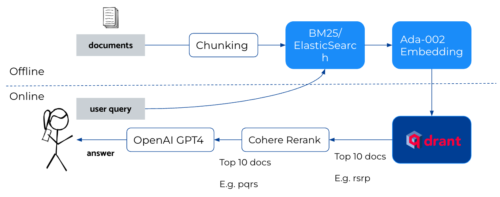

*AI4Bharat, IIT Madras, July 2023*

Namaste! 🙏 I'm Nirant and here's a brief of what we discussed in our session. 

## Why You Should Care?

I have a track record in the field of NLP and machine learning, including a paper at ACL 2020 on Hinglish, the first Hindi-LM, and an NLP book with over 5000 copies sold. I've contributed to [IndicGlue](https://indicnlp.ai4bharat.org/) by AI4Bharat, built and deployed systems used by Nykaa, and consulted for healthcare enterprises and YC companies. I also manage India’s largest GenAI community with regular meetups since February 2023. [Github](https://github.com/NirantK)

## AI4Humans: Retrieval Augmented Generation for India

We dived into two main areas:

1. **Retrieval Augmented Generation**: Examples of RAG for India, engineering choices, open problems, and how to improve it 
1. **LLM Functions**: Exploring tool augmentation and "perfect" natural language parsing

### Retrieval Augmented Generation (RAG)

RAG is a popular pattern in AI. It's used in various applications like FAQ on WhatsApp, customer support automation, and more. It's the backbone of services like Kissan.ai, farmer.chat and Bot9.ai.

However, there are several open problems in RAG, such as text splitting, improving ranking/selection of top K documents, and embedding selection.

### Adding Details to RAG

We can improve RAG by integrating models like OpenAI's GPT4, Ada-002, and others. We can also enhance the system by adding a Cross-Encoder and 2 Pass Search.

Despite these improvements, challenges remain in areas like evaluation, monitoring, and handling latency/speed. For instance, we discussed how to evaluate answers automatically, monitor model degradation, and improve system latency.

### Using LLM to Evaluate

An interesting application of LLM is to use it for system evaluation. For example, we can use LLM to auto-generate a QA test set and auto-grade the results of the specified QA chain. Check out this [auto-evaluator](https://github.com/langchain-ai/auto-evaluator) as an example.

### Addressing Open Problems

We discussed the best ways to improve system speed, including paged attention, caching, and simply throwing more compute at it. We also touched on security concerns, such as the need for separation of data and the use of Role Based Access Control (RBAC).

## LLM “Functions”

We explored how LLMs can be used for tool augmentation and converting language to programmatic objects or code. The Gorilla LLM family is a prime example of this, offloading tasks to more specialized, reliable models.

In the context of AgentAI, we discussed how it can help in converting text to programmatic objects, making it easier to handle complex tasks. You can check out the working code [here](https://github.com/NirantK/agentai).

Thank you for attending the session! Feel free to connect with me: [Twitter](https://twitter.com/NirantK), [LinkedIn](https://linkedin.com/in/nirant) or learn more about me [here](https://nirantk.com/about).

## References

- [Slides](https://docs.google.com/presentation/d/1fzwXZJtLLdXPFHahOlSuaK62VYy2F-F-yPV5SxwA5Xo/edit?usp=sharing) for this talk
- [RAG paper](https://arxiv.org/abs/2005.11401)
- [AgentAI library](https://github.com/NirantK/agentai)
- [Auto-evaluator](https://github.com/langchain-ai/auto-evaluator)
- [Gorilla LLM family](https://gorilla.cs.berkeley.edu/)
- [vLLM](https://vllm.ai/)

*Images in this blog are taken from the slides presented during the talk.*