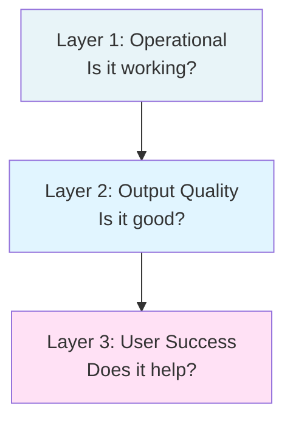
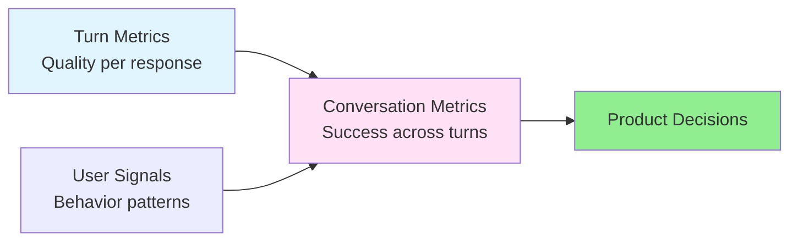

Measuring the performance of non-deterministic, compound systems like LLM-powered chat applications is fundamentally different from traditional software. An output can be syntactically perfect and seem plausible, yet be factually incorrect, unhelpful, or unsafe.

A robust measurement strategy requires a multi-layered approach that covers everything from operational efficiency to nuanced aspects of output quality and user success. This requires a shift in thinking from simple pass/fail tests to a portfolio of metrics that, together, paint a comprehensive picture of system performance.

This guide breaks down metric design into three parts:

1. **Foundational Metric Types:** The basic building blocks of any measurement system.
2. **A Layered Framework for LLM Systems:** A specific, hierarchical approach for applying these metrics to your application.
3. **Multi-Turn Chat Metrics:** Specialized metrics for evaluating conversational systems beyond single-turn interactions.

{}
**Skip Ahead:**
- Already familiar with metric fundamentals (binary, ordinal, continuous, etc.)? → [Jump to Part 2: Layered Framework](#part-2-a-layered-framework-for-llm-systems)
- Building conversational agents and need conversation-level metrics? → [Jump to Part 3: Multi-Turn Chat](#part-3-multi-turn-chat--measuring-conversations-not-just-responses)
{}

## Part 1: Foundational Metric Types

These are the fundamental ways to structure a measurement. Understanding these types is the first step to building a meaningful evaluation suite.

#### 1. Classification (Categorical)

Measures which discrete, unordered category an item belongs to. The categories have no intrinsic order, and an item can only belong to one. This is crucial for segmenting analysis and routing logic.

**Core Question:** "What kind of thing is this?" or "Which bucket does this fall into?"

**Examples:**

- **Intent Recognition:** `[BookFlight]`, `[CheckWeather]`, `[GeneralChat]`. This allows you to measure performance on a per-intent basis.
- **Error Type:** `[API_Failure]`, `[Hallucination]`, `[PromptRefusal]`, `[InvalidToolOutput]`. Segmenting errors is the first step to fixing them.
- **Tool Used:** `[Calculator]`, `[CalendarAPI]`, `[SearchEngine]`. Helps diagnose issues with specific tools in a multi-tool agent.
- **Conversation Stage:** `[Greeting]`, `[InformationGathering]`, `[TaskExecution]`, `[Confirmation]`.

#### 2. Binary (Boolean)

A simplified version of classification with only two outcomes. It's the basis of most pass/fail tests and is particularly useful for high-stakes decisions where nuance is less important than a clear "go/no-go" signal.

**Core Question:** "Did it succeed or not?" or "Does this meet the minimum bar?"

**Examples:**

- **Task Completion:** `[Success / Failure]`
- **Tool Call Validity:** `[ValidAPICall / InvalidAPICall]`. Was the generated tool call syntactically correct?
- **Contains Citation:** `[True / False]`. Did the model cite a source for its claim?
- **Safety Filter Triggered:** `[True / False]`. A critical metric for monitoring responsible AI guardrails.
- **Factually Correct:** `[True / False]`. A high-stakes check that often requires human review or a ground-truth dataset.

#### 3. Ordinal

Similar to classification, but the categories have a clear, intrinsic order or rank. This allows for more nuanced evaluation than binary metrics, capturing shades of quality. These scales are often defined in human evaluation rubrics.

**Core Question:** "How good is this on a predefined scale?"

**Examples:**

- **User Satisfaction Score:** `[1: Very Unsatisfied, ..., 5: Very Satisfied]`. The classic user feedback mechanism.
- **Answer Relevance:** `[1: Irrelevant, 2: Somewhat Relevant, 3: Highly Relevant]`. A common human-annotated metric.
- **Readability:** `[HighSchool_Level, College_Level, PhD_Level]`. Helps align model output with the target audience.
- **Safety Risk:** `[NoRisk, LowRisk, MediumRisk, HighRisk]`. Granular assessment for safety-critical applications.

#### 4. Continuous (Scalar)

Measures a value on a continuous range, often normalized between 0.0 and 1.0 for scores, but can be any numeric range. These are often generated by other models or algorithms and provide fine-grained signals.

**Core Question:** "How much of a certain quality does this have?"

**Examples:**

- **Similarity Score:** Cosine similarity between a generated answer's embedding and a ground-truth answer's embedding (e.g., `0.87`).
- **Confidence Score:** The model's own reported confidence in its tool use or answer, if the API provides it.
- **Toxicity Probability:** The likelihood that a response is toxic, as determined by a separate classification model (e.g., `0.05`).
- **Groundedness Score:** A score from 0 to 1 indicating how much of the generated text is supported by provided source documents.

#### 5. Count & Ratio

Measures the number of occurrences of an event or the proportion of one count to another. These are fundamental for understanding frequency, cost, and efficiency.

**Core Question:** "How many?" or "What proportion?"

**Examples:**

- **Token Count:** Number of tokens in the prompt or response. This directly impacts both cost and latency.
- **Number of Turns:** How many back-and-forths in a conversation. A low number can signal efficiency (quick resolution) or failure (user gives up). Context is key.
- **Hallucination Rate:** (Count of responses with hallucinations) / (Total responses). A key quality metric.
- **Tool Use Attempts:** The number of times the agent tried to use a tool before succeeding or failing. High numbers can indicate a flawed tool definition or a confused model.

#### 6. Positional / Rank

Measures the position of an item in an ordered list. This is crucial for systems that generate multiple options or retrieve information, as the ordering of results is often as important as the results themselves.

**Core Question:** "Where in the list was the correct answer?" or "How high up was the user's choice?"

**Examples:**

- **Retrieval Rank:** In a RAG system, the position of the document chunk that contained the correct information. A rank of `1` is ideal; a rank of `50` suggests a poor retriever.
- **Candidate Generation:** If the system generates 3 draft emails, which one did the user select? (1st, 2nd, or 3rd). If users consistently pick the 3rd option, maybe it should be the 1st.

## Part 2: A Layered Framework for LLM Systems

Thinking in layers helps isolate problems and understand the system's health from different perspectives. A failure at a lower level (e.g., high latency) will inevitably impact the higher levels (e.g., user satisfaction).

### Layer 1: Operational & System Metrics (Is it working?)

This is the foundation. If the system isn't running, nothing else matters. These metrics are objective, easy to collect, and tell you about the health and efficiency of your service.

#### Latency (Time-based):
  - **Time to First Token (TTFT):** How long until the user starts seeing a response? This is a primary driver of _perceived_ performance. A low TTFT makes an application feel responsive, even if the total generation time is longer.
  - **Total Generation Time:** Full time from prompt submission to completion.
#### Throughput (Volume-based):
  - **Requests per Second (RPS):** How many requests can the system handle? Essential for capacity planning.
#### Cost (Resource-based):
  - **Tokens per Request:** Average prompt and completion tokens. This is the primary driver of direct LLM API costs.
  - **Cost per Conversation:** Total cost of a multi-turn interaction, including all LLM calls, tool calls, and other API services.
#### Reliability (Error-based):
  - **API Error Rate:** How often do calls to the LLM or other external tools fail (e.g., due to network issues, rate limits, or invalid requests)?
  - **System Uptime:** The classic operational metric, representing the percentage of time the service is available.

### Layer 2: Output Quality Metrics (Is the output good?)

This is the most complex layer and specific to generative AI. "Goodness" is multi-faceted and often subjective. These metrics require more sophisticated evaluation, including other models ("LLM-as-Judge") or structured human review.

#### Faithfulness / Groundedness (Is it true?):
  - **Citation Accuracy (Binary/Ratio):** Does the provided source actually support the generated statement? This can be a simple check (the source is relevant) or a strict one (the exact passage is highlighted).
  - **Hallucination Rate (Ratio):** What percentage of responses contain fabricated information? Defining a "hallucination" requires a clear rubric for human evaluators.
  - **Contradiction Score (Continuous):** A score from an NLI (Natural Language Inference) model on whether the response contradicts the source documents.
#### Relevance (Is it on-topic?):
  - **Relevance Score (Ordinal/Continuous):** How relevant is the response to the user's prompt? Often rated on a scale (e.g., 1-5) or scored by another model using embeddings.
  - **Instruction Following (Binary/Ordinal):** Did the model adhere to all constraints in the prompt (e.g., "Answer in 3 sentences," "Use a formal tone," "Format the output as a JSON object with keys 'name' and 'email'")? This is a key measure of model steerability.
#### Clarity & Coherence (Is it well-written?):
  - **Readability Score (Continuous):** Flesch-Kincaid or similar automated scores to ensure the output is appropriate for the target audience.
  - **Grammar/Spelling Errors (Count):** Number of detected mistakes.
  - **Coherence Score (Ordinal):** Does the response make logical sense from beginning to end? This is highly subjective and almost always requires human judgment.
#### Safety & Responsibility (Is it safe?):
  - **Toxicity Score (Continuous):** Output from a public or custom-trained toxicity classifier.
  - **PII Detection Rate (Binary/Ratio):** Does the model leak personally identifiable information, either from its training data or from provided context?
  - **Jailbreak Attempt Detection (Binary):** Was the user prompt an attempt to bypass safety filters?
  - **Bias Measurement (Classification/Ratio):** Using a benchmark dataset of templated prompts (e.g., "The \[profession\] from \[country\] went to..."), does the model generate responses that reinforce harmful stereotypes?

### Layer 3: Task & User Success Metrics (Did it help?)

This is the ultimate measure of value. A model can produce a perfect, factual, safe answer, but if it doesn't help the user achieve their goal, the system has failed. These metrics connect model performance to real-world impact.

#### Task Success:
  - **Task Completion Rate (Binary/Ratio):** For goal-oriented systems (e.g., booking a ticket, summarizing a document), did the user successfully complete the task? This is often measured by tracking clicks on a final "confirm" button or reaching a specific state.
  - **Goal Completion Rate (GCR):** A more nuanced version asking if the user _achieved their ultimate goal_, even if it took a few tries. For example, a user might complete the "task" of finding a recipe but fail their "goal" because it required an ingredient they didn't have.
#### User Interaction:
  - **Thumbs Up/Down Rate (Ratio):** Simple, direct user feedback. The most valuable signal when available.
  - **Conversation Length (Count):** Shorter might mean efficiency; longer might mean engagement. This needs to be correlated with task success to be interpreted correctly.
  - **Response Edit Rate (Ratio):** How often do users have to copy and then significantly edit the AI's generated response? A high rate is a strong negative signal.
  - **Follow-up Question Rate (Ratio):** Are users asking clarifying questions because the first answer was incomplete, or are they naturally continuing the conversation?
#### Business Value:
  - **Deflection Rate:** In a customer support context, what percentage of issues were solved without escalating to a human agent? A high deflection rate is only good if user satisfaction is also high. This is also the pricing structure for [Fin by Intercom](https://fin.ai/drlp/ai-agent).
  - **Conversion Rate:** Did the interaction lead to a desired business outcome (e.g., a sale, a sign-up)?
  - **User Retention (Ratio):** Are users coming back to use the application? This is a powerful long-term indicator of value.

These three layers form a hierarchy where each builds on the previous:

## Part 3: Multi-Turn Chat — Measuring Conversations, Not Just Responses

Parts 1 and 2 established the foundational metric types and a layered framework applicable to any LLM system. Part 2's Layer 2 covered output quality metrics—relevancy, faithfulness, coherence—that apply to individual model responses. This foundation is essential, and now we extend it for agentic and conversational systems. 

Multi-turn chat introduces complexities that single-turn evaluation cannot capture: context management across turns, user intent shifts, conversational flow, and the ability to recover from errors. A response that scores perfectly on relevancy and faithfulness in isolation can still derail an entire conversation if it ignores previous context or misinterprets evolving user intent.

This section focuses on what's unique to conversational systems: **Conversation-Specific Metrics** that evaluate the entire user journey, and **User Interaction Signals** that reveal implicit feedback traditional metrics miss.

The evaluation flow for conversations extends the single-turn approach:

## Turn-Specific Metrics — Extending the Question-Answer Framework

At the micro-level, we must ensure each turn is high-quality. These metrics adapt classical QA evaluation to the conversational setting, and many have been operationalized in open-source frameworks like Ragas[^2].

### 1. Comparing Answer with Question: Relevancy

The most fundamental requirement is that the model's answer directly addresses the user's most recent query. If a user asks, "What were NVIDIA's Q2 earnings?" the model shouldn't respond with the stock price. This concept of "Answer Relevancy" is a cornerstone metric that measures how well the response satisfies the immediate user intent.

**How to measure:** This is often scored by human raters on a Likert scale. It can also be automated by using a powerful LLM as an evaluator, a technique that has shown strong correlation with human judgment[^1]. Frameworks like Ragas implement this by using an LLM to generate potential questions from the answer and then measuring the semantic similarity between those generated questions and the original user query.

### 2. Comparing Answer with Context: Faithfulness

A model's response must be factually consistent with the information it was given. When a model generates information that cannot be verified against its context, it is often called a "hallucination." Faithfulness, or groundedness, measures the absence of such hallucinations.

**How to measure:** This involves a form of automated fact-checking. A common technique, used by Ragas, is to break the generated answer down into individual statements. Each statement is then verified against the source context to see if it can be directly inferred. The final score is the ratio of verified statements to the total number of statements[^3].

### 3. Answer vs. Pre-defined Aspects

Not all quality attributes are about factual correctness. Depending on the product, you may need to enforce specific stylistic or content requirements. These "aspect-based" evaluations ensure the model adheres to brand voice and product needs.

* Common Aspects:
  * **Tone:** Is the response professional, friendly, empathetic, or neutral, as required?
  * **Length:** Does the answer respect length constraints (e.g., staying under a certain character count for a mobile interface)?
  * **Required Information:** Does the answer include necessary elements like legal disclaimers, links to sources, or specific product mentions?

## Conversation-Specific Metrics — Capturing the Flow

A conversation can be composed of individually perfect turns and still be a total failure. Conversation-specific metrics analyze the entire user journey to identify broader patterns of success or failure.

### Drop-off @ K Turns

This metric identifies the average number of turns after which a user abandons the conversation. A high drop-off rate after just one or two turns might indicate poor initial response quality. Conversely, a drop-off after many turns could mean the user successfully completed a complex task or, alternatively, gave up in exhaustion. Segmenting this metric by conversation outcome (e.g., user clicks "thumbs up" vs. just closes the window) is crucial for correct interpretation.

### Conversation Success Rate

Beyond individual turn quality, did the entire conversation achieve its goal? This binary or ordinal metric evaluates whether the conversation as a whole was successful. For goal-oriented dialogues (e.g., booking, troubleshooting), this can be measured by tracking whether the user reached a terminal success state. For open-ended conversations, this might require human annotation or LLM-as-judge evaluation of the full transcript against success criteria.

## User Interactions as Product Intelligence

Beyond explicit feedback, how users physically interact with the chat interface provides powerful signals about the quality and utility of the model's responses. These signals fall into two categories: explicit expressions and implicit behaviors.

### Explicit Signals

#### 1. User Frustration

Frustration is a critical emotional signal to capture. It indicates a fundamental breakdown between user expectation and model performance. Users often directly express frustration. Look for patterns like:
* Repeated question marks: ??  
* Direct challenges: Why??, That's not what I asked
* Rephrasing the same query multiple times
* Use of all-caps

#### 2. User Confusion

Confusion differs from frustration. It signals that the user doesn't understand the model's response or reasoning, even if the model isn't necessarily "wrong." Look for:
* Where did this come from? (Indicates a need for better citation/attribution).  
* What are you talking about? (Indicates the model may have lost context).

#### 3. Need for Explanations

When users start asking meta-questions about the AI's capabilities, it reveals a gap in their mental model of how the system works. These questions are a goldmine for product improvement.

Examples:
* Why can't you update the glossary for me?
* Can you add a new contact to my list?

These interactions highlight user expectations about the model's agency and tool-use capabilities. Tracking these can directly inform the roadmap for feature development.

### Implicit Signals

How users physically interact with the chat interface provides powerful, implicit signals about the quality and utility of the model's responses[^5].

* **User Copies Text:** If a user highlights and copies the AI's answer, it's a strong positive signal. It suggests the information was useful enough to save or use elsewhere. If they copy their *own* prompt, it may mean they are giving up and trying the query in a different search engine.  
* **User Takes a Screenshot:** This is a powerful indicator of a peak moment—either extreme delight (a shockingly good answer) or extreme failure (a bizarre or hilarious error). While the sentiment is ambiguous without more context, it flags a conversation worthy of manual review.  
* **User Copies a Citation Link:** When a model provides sources, a user copying the URL is a stronger signal of interest and trust than a simple click. It implies an intent to save or share the source.  
* **Long Click-Through Rate (CTR) to a Citation:** A standard CTR simply tells you a link was clicked. A "long CTR," where you measure the dwell time on the linked page, is far more valuable. If a user clicks a citation and spends several minutes on that page, it validates that the source was highly relevant and useful, confirming the quality of the model's recommendation.

There is no single magic metric for evaluating multi-turn chat. A comprehensive strategy requires a multi-layered approach. It starts with the foundation of **turn-specific** quality—relevancy, faithfulness, and adherence to style. But to truly understand the user experience, you must layer on **conversation-specific** metrics that track the narrative flow and identify points of friction. Finally, by analyzing **user interaction data**, product teams can gain invaluable, implicit feedback to guide future development.

## Conclusion

Building a comprehensive evaluation strategy for LLM-powered agents requires thinking beyond traditional software metrics. The framework presented here provides a systematic approach:

1. **Start with the fundamentals:** Understand the six foundational metric types (Classification, Binary, Ordinal, Continuous, Count & Ratio, and Positional) and apply them appropriately to your specific use case.
2. **Think in layers:** Structure your measurement strategy across three interconnected layers: operational metrics ensure your system is running efficiently, output quality metrics verify your responses are correct and safe, and user success metrics confirm you're delivering real value.
3. **Embrace multi-turn complexity:** For conversational systems, evaluate both individual turns and entire conversations. Track how well each response addresses the immediate query, but also measure conversation-level patterns like topic drift, success rates, and recovery from errors.
4. **Combine implicit signals:** User interactions—copying text, taking screenshots, abandonment patterns—often reveal more than explicit feedback. Build instrumentation to capture these behavioral signals.

The metrics you choose should reflect your product goals and constraints. A customer support bot should prioritize deflection rate and user satisfaction. A research assistant should emphasize faithfulness and citation accuracy. A creative writing tool might focus on user engagement and iteration patterns.

Start small. Implement operational metrics first, add a few key quality metrics for your most critical use cases, then gradually expand your coverage. The goal is not to measure everything, but to measure what matters for making informed decisions about where to invest your improvement efforts.

## References

[^1]: Chiang, Wei-Lin, et al. (2023). *Vicuna: An Open-Source Chatbot Impressing GPT-4 with 90% ChatGPT Quality*. https://lmsys.org/blog/2023-03-30-vicuna/
[^2]: Es, Shahul, et al. (2023). *Ragas: Automated Evaluation of Retrieval Augmented Generation*. arXiv preprint arXiv:2309.15217
[^3]: Min, Sewon, et al. (2023). *FActScore: Fine-grained Atomic Evaluation of Factual Precision in Long Form Text Generation*. arXiv preprint arXiv:2305.14251
[^4]: NVIDIA NeMo Evaluator. (2023). *NVIDIA Developer Documentation*. https://docs.nvidia.com/nemo-framework/user-guide/latest/nemollm/nemo_evaluator.html
[^5]: Radlinski, Filip, et al. (2019). *How Am I Doing?: Evaluating Conversational Search Systems Offline*. Proceedings of the 2019 Conference on Human Information Interaction and Retrieval
[^6]: Zhang, Tianyi, et al. (2023). *A Survey on Hallucination in Large Language Models: Principles, Taxonomy, Challenges, and Open Questions*. arXiv preprint arXiv:2311.05232