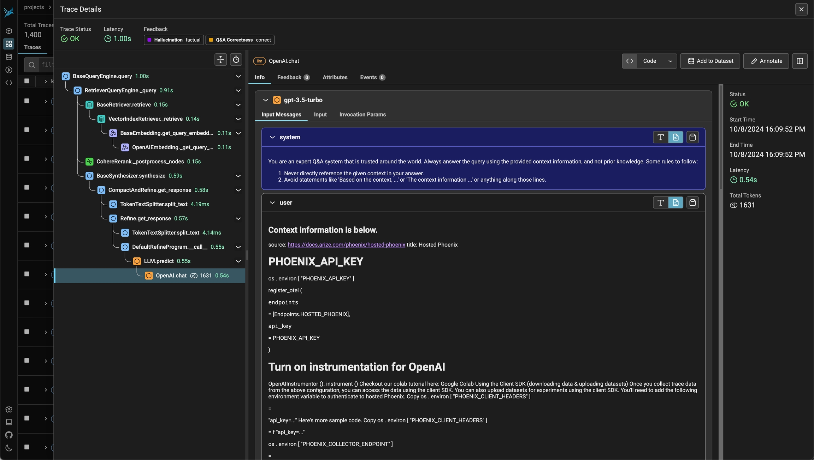

There’s a quiet but important debate happening in the LLM observability world — whether developers should stick with OpenTelemetry (OTel) or move to OpenInference, a spec built by Arize for tracing LLM workloads.

Most people frame this as “OTel vs OpenInference,” as if one will win and the other will vanish. That’s the wrong lens. The real question is: what are you trying to observe — systems or reasoning?

If your product is a traditional service with predictable APIs, OTel works beautifully. But once your system starts reasoning, calling tools, and chaining LLMs together, you’ve left OTel’s comfort zone. That’s where OpenInference comes in — it extends OTel with span types and attributes that actually make sense for LLMs: token usage, cost per request, time to first token, and tool calls. It’s not competing with OTel — it’s extending it into a new domain.

So when I read the recent [Signoz essay](https://signoz.io/blog/llm-observability-opentelemetry/) arguing that "OTel is enough for LLM observability" I disagreed — not because OTel is wrong, but because the framing misses what's fundamentally new about GenAI workloads.

OpenInference is an enriched version of OTel built specifically for LLMs. It offers more specific span types for LLMs, including LLM, tool, and agent. It is first and foremost built for developers to use in their own LLM-powered applications, where they want to log LLM choices and actions. OpenInference was designed to be complementary to OpenTelemetry GenAI [^4], not an alternative. It already provides OTel-friendly instrumentations and semantic conventions.

As an example, the metrics which OpenInference takes seriously are: Token usage, cost per request, time to first token, tool call rates. And the original OTel cares about the RED metrics [^3] e.g. latency, error rates, and throughput.

Signoz is not alone in making a case for OTel against OpenInference. The main case is quite simple: OTel is a well-established standard with broad language support, while OpenInference is newer, has limited adoption, and its OTel compatibility is superficial.

## The Case for OpenInference

I disagree with the main case for OTel against OpenInference: compatibility triumphs everything else.

If this was the case, we should not have needed anything except Postgres for structured data. From ClickHouse to Snowflake, we have a lot of differentiation in the usecases and tradeoffs. And that is precisely the case with OpenInference and OTel.

To extend this metaphor: Every system adopts the SQL dialect to make it their own. Like SQL dialects, OTel and OpenInference share a syntax but serve different workloads. If you’re building an LLM product that needs to explain its reasoning, optimize latency, or debug tool calls — OpenInference gives you visibility that OTel simply can’t today:

### OpenInference is a better choice for agentic systems

Agents are products where LLMs are in the driver's seat and not the developers. All modern _agents_ [^1] have this property. This means that the debug and RCA loop is much much faster and easier with OpenInference. 

For instance, when an agent fails, a standard OTel trace might show a single long-running `process_request` span. An OpenInference trace, however, would immediately break this down into `LLM` -> `TOOL_CALL(search)` -> `RETRIEVER` -> `LLM` spans, instantly revealing that the failure occurred because the search tool got stuck in a loop or something in the query rewriting step needs to improve.

This nesting visualization is also quite powerful and something I deeply appreciate when trying to debug agents:

_Source: [Arize Phoenix Tracing Documentation](https://arize.com/docs/phoenix/tracing/llm-traces)_

### Logs as Analytics data

OpenInference logs are actually data meant for not just alerting 500 and 429 but for product analytics and observability. This means that the data is actually meant to be used for more than just API alerting.

This shift towards product analytics is critical because we lack traditional user intent signals, like 'click events,' in conversational interfaces. With the high effort of text and voice interactions, we can't rely on the law of large numbers.

For example: With semantically rich spans for `TOOL_CALL`, a product manager can finally answer questions like, 'Which tools are my users' agents invoking most often?' or 'Are users getting stuck in a loop trying to use the calendar tool?'. These are product questions, not just engineering alerts, and they are invisible in a standard RED metrics dashboard.

The third reason is a little different: I think it's useful to revisit why OpenInference even exists: OTel didn't have a decent spec for GenAI workloads! It is on its way to have one, but as modern APIs change e.g. OpenAI went from Chat Completions to Responses API [^6]. As a specialized, single-focus project, OpenInference is structurally positioned to adapt to the rapid evolution of GenAI APIs far more quickly than a large, consensus-driven standards body like OTel.

## What can OpenInference do better?

1. [OpenInference](https://github.com/Arize-ai/openinference) is completely maintained and developed by Arize.ai. It is not a community effort, despite being Apache 2.0 (the project's contributors reveals this quickly[^5]). This single-vendor stewardship creates a natural friction against broader adoption.

2. The most effective way for Arize to counter this would be to aggressively pursue OTel compatibility, proving that OpenInference is a good faith extension of the ecosystem, not a replacement aimed at vendor lock-in. This would mean that all OTel logging frameworks and tools should be able to use OpenInference, and hence switch to Arize Phoenix from other logging frameworks and tools. 

## Putting myself in others' shoes

From Arize's perspective, delaying the push for OTel compatibility might be the right move. The standard hasn't matured fast enough, and moving independently lets them stay ahead of the curve and address developer needs more quickly.

If I were at Signoz and wanted to own GenAI logging and alerting, I'd create a Signoz plugin that accepts both OpenInference traces and OTel GenAI [^4] traces, offering the same nested visualization capabilities that make Phoenix compelling.

## Conclusion

Ultimately, the debate isn't about OTel versus OpenInference. We should acknowledge that observing generative AI is a fundamentally new problem that requires more than just knowing if an endpoint is healthy. We need a richer vocabulary to understand what our applications are doing and why. And the strategic bet is clear: LLMs are not another web service — they’re runtime decision-makers. And observing them needs a richer language than latency, error, and throughput.

If OTel is the lingua franca of distributed systems, OpenInference is the dialect for reasoning systems. The two are not competitors — they’re layers. OTel tells you how your system behaves, OpenInference tells you why.

## References

[^1]: A good alternative definition is a LLM while loop with tools: https://www.braintrust.dev/blog/agent-while-loop
[^2]: [Law of large numbers](https://en.wikipedia.org/wiki/Law_of_large_numbers) makes clicks way useful for SaaS and consumer applications alike
[^3]: [RED metrics](https://grafana.com/blog/2018/08/02/the-red-method-how-to-instrument-your-services/)
[^4]: [OTel GenAI Spec](https://opentelemetry.io/docs/specs/semconv/gen-ai/)
[^5]: Most contributors to Arize's OpenInference are all their employees, with top 3 contributors coming from their own DevRel team. Source: [Github Contributions](https://github.com/Arize-ai/openinference/graphs/contributors)
[^6]: OpenAI built the Responses API to support multi-modal and tool calling as first class concerns: [OpenAI blog on Why Responses API](https://developers.openai.com/blog/responses-api/)
