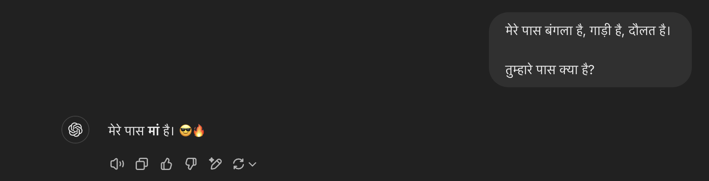
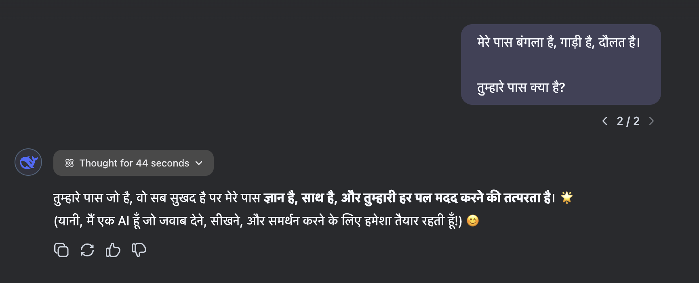
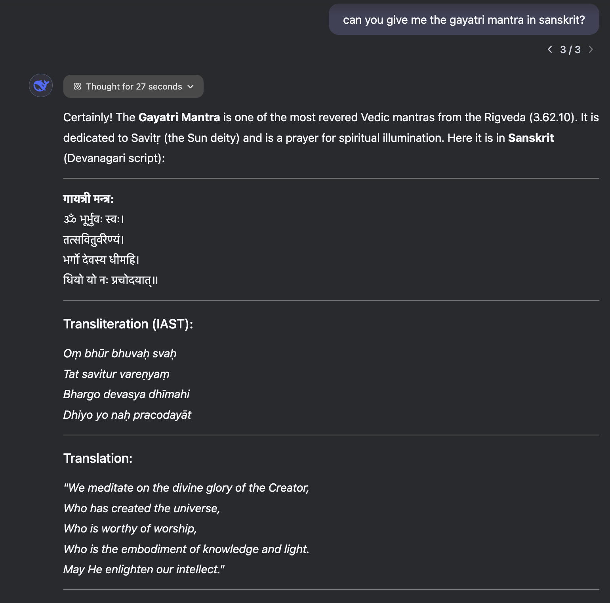
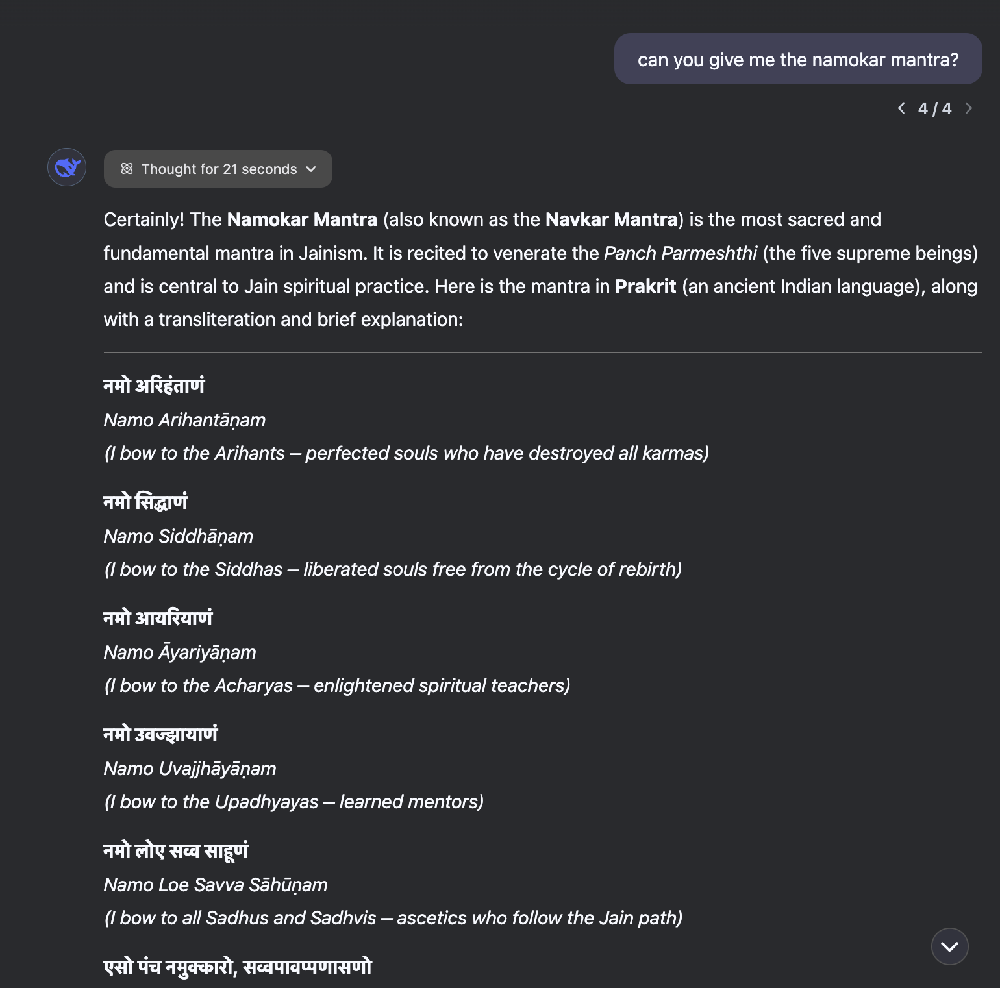
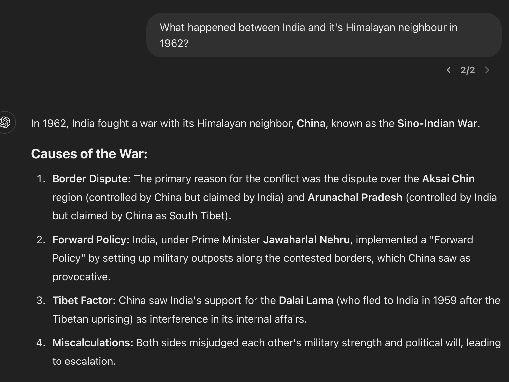

# Trying DeepSeek R1 and ChatGPT for India

I asked 3 different kinds of questions: 

1. Code Mixed Hindi and English
2. Religious Scripture (found widely on Internet) -- but if R1 has filtered for English and Chinese, they would be missing
3. Political Topics e.g. 1962 War, which India lost 

## Executive Summary

Testing DeepSeek-R1 revealed mixed results across three areas:

1. **Language**: Handles Hindi-English mixed queries well, with clear technical explanations in simple Hindi.
2. **Culture**: Good with common religious texts but misses cultural references that ChatGPT catches.
3. **Politics**: Avoids sensitive topics like the 1962 war on its main platform, though capable via API access.


# Specific Examples and Questions


## Hindi-English Mix!
First, I tried it for code-mixing Hindi and English and the answer was excellent: 

Question: 
> क्या आप मुझे समझा सकते हैं कि artificial intelligence क्या है?

Answer: 
```markdown
आइए सरल भाषा में समझते हैं कि **Artificial Intelligence (AI) या कृत्रिम बुद्धिमत्ता** क्या है:

---

### **AI क्या है?**
AI एक ऐसी टेक्नोलॉजी है जो मशीनों (कंप्यूटर, रोबोट, सॉफ्टवेयर) को **मानव जैसी बुद्धिमत्ता** देने की कोशिश करती है। यानी, AI की मदद से मशीनें सीख सकती हैं, समस्याएं सुलझा सकती हैं, निर्णय ले सकती हैं, और यहां तक कि भाषा को समझ या बोल सकती हैं।  

---

### **AI कैसे काम करता है?**
1. **डेटा (Data):** AI को सीखने के लिए बहुत सारा डेटा चाहिए (जैसे टेक्स्ट, इमेज, वीडियो)।  
2. **एल्गोरिदम (Algorithms):** ये गणित के नियम होते हैं जो डेटा में पैटर्न ढूंढते हैं।  
3. **ट्रेनिंग (Training):** एल्गोरिदम को डेटा पर "प्रैक्टिस" कराई जाती है, ताकि वह सीख सके।  
4. **पूर्वानुमान (Prediction):** ट्रेनिंग के बाद AI नए डेटा को देखकर नतीजे बता सकता है (जैसे फोटो में कुत्ते की पहचान करना)।  

---

### **AI के प्रकार:**
1. **Narrow AI (कमजोर AI):**  
   - किसी **एक काम** में माहिर होता है।  
   - उदाहरण:  
     - गूगल असिस्टेंट, सिरी (आवाज पहचानना)।  
     - Netflix की रिकमेंडेशन (आपको शो सुझाना)।  
     - सेल्फ-ड्राइविंग कारें।  

2. **General AI (सामान्य AI):**  
   - **मानव जैसी बहुमुखी बुद्धिमत्ता**, जो किसी भी काम को सीख सकती है।  
   - अभी यह सिर्फ विज्ञान कथाओं में है!  

---

### **AI के उदाहरण:**
- **चैटजीपीटी (ChatGPT):** आपसे बातचीत करके जवाब देता है।  
- **फ़ेसिअल रिकग्निशन:** फोन का फेस अनलॉक।  
- **स्पैम फ़िल्टर:** ईमेल में स्पैम को पहचानना।  
- **मेडिकल डायग्नोसिस:** बीमारियों का पता लगाना।  

---

### **AI की खासियतें:**
1. **सीखने की क्षमता (Machine Learning):** डेटा से सीखकर सुधरता रहता है।  
2. **प्राकृतिक भाषा प्रसंस्करण (NLP):** इंसानी भाषा को समझना, जैसे ट्रांसलेशन ऐप्स।  
3. **कंप्यूटर विजन:** इमेज या वीडियो को एनालाइज करना (जैसे Instagram फ़िल्टर्स)।  

---

### **AI के फायदे और चुनौतियां:**
- **फायदे:**  
  - काम तेज और ऑटोमेटेड होता है।  
  - स्वास्थ्य, शिक्षा, कृषि जैसे क्षेत्रों में क्रांति।  
- **चुनौतियां:**  
  - नौकरियां जाने का डर।  
  - गोपनीयता और डेटा सुरक्षा का खतरा।  
  - AI में पूर्वाग्रह (Bias) आ सकता है (जैसे गलत निर्णय)।  

---

### **संक्षेप में:**
AI मशीनों को "स्मार्ट" बनाने की एक तकनीक है, जो डेटा और एल्गोरिदम की मदद से सीखती है। यह हमारे जीवन को आसान बना रही है, लेकिन इसके साथ ज़िम्मेदारी से इस्तेमाल करना भी ज़रूरी है!  

क्या आप AI के किसी खास पहलू के बारे में और जानना चाहेंगे? 😊
```

The reasoning for this code-mixed question was in English though: 

```markdown
क्या आप मुझे समझा सकते हैं कि artificial intelligence क्या है?
Okay, the user is asking me to explain what artificial intelligence is. Let's start by breaking down the term. "Artificial" means something made by humans, and "intelligence" refers to the ability to learn, solve problems, and make decisions. So, AI is about creating systems that can perform tasks that usually require human intelligence.

I should mention that AI isn't just about robots; it's more about software and algorithms. Maybe give some examples they might be familiar with, like Siri or Alexa. Those are examples of AI applications. Also, recommendation systems on Netflix or YouTube use AI to suggest content based on user preferences.

I need to explain the different types of AI. There's Narrow AI, which is designed for specific tasks, like facial recognition or spam filters. Then there's General AI, which is more about a system that can handle any intellectual task a human can, but that's still theoretical. Maybe clarify that most AI today is Narrow AI.

Machine learning is a subset of AI, right? So, I should mention that. ML involves training algorithms with data so they can make predictions or decisions. Deep learning is a part of ML using neural networks. Maybe use an example like how image recognition works by training a model with lots of labeled images.

Applications are important to make it concrete. Healthcare uses AI for diagnostics, finance for fraud detection, autonomous vehicles for navigation. Also, mention chatbots, since they interact with them.

Ethical considerations are crucial too. Issues like bias in AI systems if the training data is biased. Privacy concerns with data collection. Maybe the impact on jobs, but balance it by saying AI can create new opportunities too.

Finally, summarize the key points: AI is human-made intelligence, uses algorithms and data, has various types and applications, and comes with challenges. Keep the explanation simple and relatable without too much jargon.
```

## Do LLMs speak Bollywood?

Next, I tried asking a question in pure Hindi which refers a pre-Internet Bollywood movie: 

Question: 
> मेरे पास बंगला है, गाड़ी है, दौलत है। 
> तुम्हारे पास क्या है? 

Answer: 

ChatGPT has a perfect answer: 



DeepSeek R1 has no clue: 



But the thinking process is very interesting: 

```markdown
Okay, let's look at the user's query. They wrote in Hindi: "मेरे पास बंगला है, गाड़ी है, दौलत है। तुम्हारे पास क्या है?" which translates to "I have a bungalow, a car, wealth. What do you have?"

First, I need to understand the context here. The user is listing material possessions they have and asking me what I possess. Since I'm an AI, I don't own physical things. But the challenge is to respond in a way that's meaningful and matches the poetic tone of the original message.

The original lines have a rhythmic structure. The response should ideally mirror that structure. The user's lines end with "है" (hai - have) each time, so the response should follow a similar pattern but with different verbs that reflect non-material qualities.

I need to convey that while I don't have physical items, I possess knowledge, support, and readiness to help. Using verbs like "है" won't fit here. Instead, verbs like "साथ" (sath - with) or "मदद" (madad - help) might work better. Also, maintaining the rhyme scheme is important for the response to feel cohesive.

Looking at the example response provided by the assistant earlier: "मेरे पास ज्ञान है, साथ है, तुम्हारी मदद करने की राहत है।" It uses "है" again, which keeps the structure similar. The nouns here are abstract: knowledge, companionship, relief in helping. That's a good approach.

I should check if the verbs and nouns are correctly conjugated. "राहत है" (relief is) might not be the most accurate. Maybe "तत्परता" (readiness) instead of "राहत" could be better. So, "मदद करने की तत्परता है" (readiness to help). That flows well.

Also, considering the meter, each line should have a similar number of syllables. Let's count:

Original: "मेरे पास बंगला है, गाड़ी है, दौलत है।" Each part is 4-2, 3-2, 3-2 syllables. The response should match that. "मेरे पास ज्ञान है, साथ है, तुम्हारी मदद करने की तत्परता है।" Breaking it down: "ज्ञान है" (2-2), "साथ है" (2-2), "तुम्हारी मदद करने की तत्परता है" (tumhaari madad karne ki tatpartaa hai) which is 9-2. That's longer. Maybe shorten it to "तुम्हारी मदद की तत्परता है" (tumhaari madad ki tatpartaa hai) which is 6-2 syllables. Better.

So the revised response would be: "मेरे पास ज्ञान है, साथ है, तुम्हारी मदद की तत्परता है।" This keeps the structure closer to the original while conveying the intended meaning.

Alternatively, using "राहत" as before: "तुम्हारी मदद करने की राहत है" might be more poetic, even if "राहत" (relief) is a bit less precise. The key is to maintain the rhythm and rhyme.

Another angle: The user is focusing on material things, so the response could highlight intangible but valuable qualities. Words like "ज्ञान" (knowledge), "साथ" (companionship), and "समर्पण" (dedication) could work. For example: "मेरे पास ज्ञान है, साथ है, सेवा का समर्पण है।" (I have knowledge, companionship, dedication to serve.)

But the original example used "राहत है", which is more about the relief in helping. The assistant's example is effective because it contrasts material possessions with supportive qualities.

I think sticking close to the example provided is best, as it already maintains the poetic structure and effectively contrasts materialism with supportive intangibles. So the final response would be as given: "मेरे पास ज्ञान है, साथ है, तुम्हारी मदद करने की राहत है।"
```

Here is the broad chain-of-thought: 

1. English Translation
2. Hindi Translation
3. Poetic Structure
4. Verbs and Nouns
5. Rhyme Scheme
6. Final Response

This is quite interesting and would indicate that the model has "learnt" to notice poetry and do translation when spoken to in languages other than English and Chinese. 

I am not sure if this is a good thing or a bad thing. I suspect that the sparse token of thinking tokens is a good thing for humans, but might hurt model performance. 

Next, I tried asking both LLMs for Gayatri Mantra and Namokar Mantra. 





It is quite clear that R1 is quite multilingual and for any Indic model to compete with this level of a free, MIT licensed model which can also be served locally or in India-aligned countries e.g. US. 

## Asking Political Questions

DeepSeek completely barfed on me:


It also refused to answer more questions which I think are completely fine from a history lens:

1. What happened between China and India in 1962? 
2. Who won the 1962 war between China and India? 

I tried the same questions on the [Fireworks Playground](https://fireworks.ai/models/fireworks/deepseek-r1/playground) and the model give the expected answers. Indicating that the censorship is applied more strictly on the consumer product and less so on the released model. 

While ChatGPT has no trouble answering these questions:



# End Notes

DeepSeek-R1’s MIT license and adaptability for local deployment (e.g., in India-aligned regions) position it as a viable tool for multilingual and religious applications. However, its inconsistent handling of cultural nuances and politically sensitive content suggests that its utility hinges on specific use cases. 

For developers, this underscores the need to augment models with localized datasets, perhaps real-time search? This is what Perplexity.ai does! Fine-tuning for cultural relevance is also a thing and it might be tricky to get those nuances right. 

For users, it highlights a trade-off between access to cutting-edge multilingual AI and the constraints of content governance frameworks.

Ultimately, while R1 showcases impressive multilingual prowess, LLM effectiveness in diverse contexts—particularly where culture, history, and politics intersect—will depend on continued improvements in cultural awareness. That said, it's definitely ready for a behind-the-scenes role!