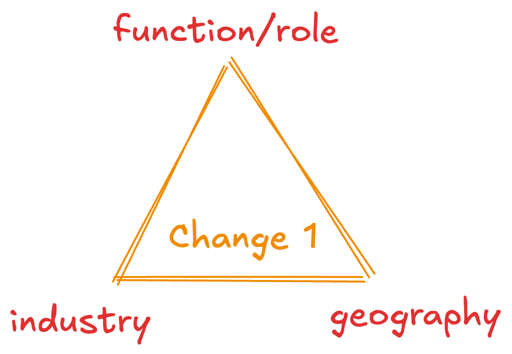

Your career is a combination of Function, Industry, Geography.

That's it.

That's the framework.

You can change one of these. Not all three at a time.

## Why only one at a time?

If you want to change your function, you need to learn new skills.

If you want to change your industry, you need to understand the new industry and the skills required to be successful in it.

If you want to change your geography, you need to uproot your life and move to a new place.

## But what if I want to change all three?

You can, but it's difficult and perhaps needs a lot of thinking cycles and internal conviction.

### Cheat code: Higher Education

MS/PhD/MBA helps folk change 2 of these at a time:

1. You might get into a PhD program which changes your function and industry both
2. MS abroad program which changes your function and geography
3. MBA program which changes your industry (e.g. IT services to consulting) and geography (e.g. India to US)

## Clarity Helps a Lot

The more granular you get, the easier it is to decide convert the wants into actionable steps. 

Painful: I want to be a Machine Learning Engineer. 

Tolerable: I want to be a Machine Learning Engineer at a Big Tech company.

Acceptable: I want to be a Machine Learning Engineer at Google.

Good: I want to be a Machine Learning Engineer at Google in New York.

Great: I want to be a Machine Learning Engineer working on the problems around generating human-like speech at Google in New York.

## What if I am not clear about what I want?

If you are not clear about what you want, that's totally fine.

You can start with the most granular level and work your way up. 

Start with the job description of the role you want. Talk to at least 12 people who are in that role.

Ask them what they do on a day-to-day basis. Ask how they got to where they are today. Ask what they ask when they are hiring or interviewing.

People on the Internet call this thing informational interviews and there's plenty of [decent advice](https://career.berkeley.edu/start-exploring/informational-interviews/) out there.

## Recommended Reading

1. [The Antidote to I'm Feeling Stuck?](https://com.queries.fun/p/the-antidote-to-i-am-feeling-stuck) from [Swanand](https://x.com/_swanand)
2. [Act Like You're 35](./actlike35.md) from [Nirant](https://x.com/nirantk)