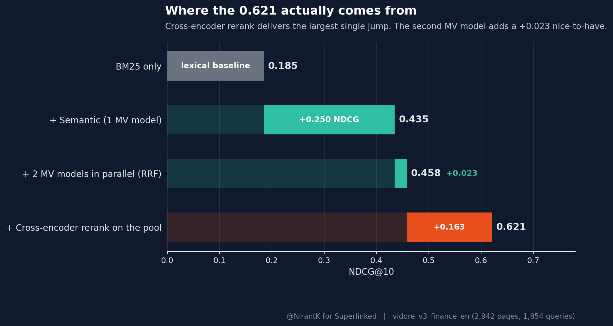

> Disclosure: [Superlinked](https://superlinked.com) sponsored this benchmarking project and the compute. I'll keep using SIE for [genka.dev](https://genka.dev)'s Indian financial-document pipeline on my own cluster. Sponsored or not, the deploy story is the reason. 

If you run retrieval inside a customer VPC and can't pin a fixed GPU per model, you've probably hit the same wall I did: every embedder and reranker wants its own deployment, and the SRE team does one deployment at a time. I want to try hundreds of models. 

I want the best pipeline for my use case, not the best single model, and SIE solves this by handling the model swapping, deployment and request queuing for me, which lets me run experiments on the end-to-end search metrics (NDCG@10, Recall@10) instead of on individual components in isolation.

This post is about the experiment I ran on [Vidore's Finance English Dataset](https://huggingface.co/datasets/vidore/vidore_v3_finance_en) (2,942 pages of bank 10-Ks, 1,854 queries) to find the best retrieval pipeline for that constraint. I used Karpathy's [autoresearch](https://github.com/karpathy/autoresearch?tab=readme-ov-file) loop to sweep params, and ran every model (dense, multi-vector, cross-encoder reranker) behind a single SIE endpoint. 

I can swap out models with the same ease as I'd do with a cloud provider. 
The surprise wasn't which embedder won. The actual split was brutally lopsided: **the cross-encoder reranker does ~80% of the lift over a single multi-vector baseline. The fancy dual-MV retrieval pool contributes a sliver.**

For ingestion, SIE's autoscaling handles bursty load without me sizing anything ahead of time. That balance, hot for ingest, elastic for serve, is a pain to build yourself. 

Here are the results, sorted best to worst: 



## Results

| Strategy | Model | NDCG@10 | Recall@10 | What it shows |
|----------|-------|---------|-----------|---------------|
| **2 Multi Vector Models in Parallel → Cross-Encoder Rerank** | bge-m3 + jina-colbert → mxbai-large | **0.621** | **0.665** | Best: two MV models + CE rerank |
| MV pool → CE Rerank | MV-bge200 + mxbai-large | 0.613 | 0.656 | Single MV model + CE |
| CE Rerank | mxbai-rerank-large | 0.600 | 0.640 | +52% over vector |
| CE Rerank | mxbai-rerank-base | 0.524 | 0.588 | Strong, smaller alternative |
| CE Rerank | bge-reranker | 0.521 | 0.578 | Near-identical to mxbai-base |
| 2 MV Models in Parallel (no rerank, RRF) | bge-m3 + jina-colbert (top-100 each) | 0.458 | 0.512 | Isolates how much the CE rerank is doing |
| MV Direct | bge-m3 (1024d) | 0.435 | 0.482 | No GPU at inference, +10% over vector |
| MV Rerank | jina-colbert-v2 (128d) | 0.431 | 0.494 | 96% of bge-m3 quality at 12.5% storage |
| Vector | bge-m3 dense | 0.396 | 0.438 | Strong baseline |
| RRF | BM25+Vector | 0.358 | 0.434 | Hybrid hurts here, BM25 dilutes signal |
| BM25 | Turbopuffer FTS | 0.185 | 0.239 | Keyword search alone isn't enough |

1. Candidate Retrieval: Retrieve top-100 candidates with bge-m3 MV and top-100 with jina-colbert-v2 MV separately. Union + dedup → pool of ~151 unique candidates per query. 
2. Reranking: Send that pool to mxbai-rerank-large-v2 (the CE) for final ranking.

Two MV models in parallel give the reranker a slightly more diverse candidate pool, ~51 additional unique docs after union and dedup. They cost the same wall time as one MV (parallel-fan-out, slower model gates), so the diversity is effectively free *if the orchestration layer can fire both concurrently*. On SIE, that's two `await sie.encode(...)` calls in an `asyncio.gather`. I've eaten that cost twice on stacks where every model lived in its own container. 

How much of the 0.621 actually comes from the cross-encoder, versus from adding a second MV model to the pool? To find out, I ran the same two MV models in parallel but skipped the rerank, RRF-fused the bge-m3 and jina-colbert top-100 rankings instead. That gives NDCG 0.458 / R@10 0.512: only **+0.023 NDCG over the better single MV (bge-m3 at 0.435)**. Then layering the CE rerank on the same pool takes it from 0.458 to 0.621, **+0.163 NDCG (+35.6%)** from the reranker alone. The dual-MV pool contributes a sliver of diversity; the reranker is doing roughly 80% of the lift over a single MV baseline.

MV pooling plus rerank is what's running in production now, with the cross-encoder doing the actual work (the second MV adds two-and-a-half NDCG points to the pool, which is nice to have for free, but it's not why the headline number is 0.621). 

## Cost Savings

> *Claude wrote this section. It had the receipts.*

All runs requested **NVIDIA L4 spot** via SIE's GPU router (`gpu="l4-spot"` in every script), which SIE resolves to AWS `g6.xlarge` (1× L4, 24GB VRAM, Ada Lovelace) on the spot market in `us-east-2`, and L4 spot capacity is deep enough that I haven't been preempted on these short reranker jobs.

The whole benchmark (every row in the results table, every reranker, every pool variant) was a weekend of GPU time. Concrete numbers from `autoresearch_results.tsv`:

| Workload | Wall-clock (measured) |
|---|---|
| 8 cross-encoder rerankers swept over 1,854 queries each | **4.3 GPU-hours** |
| 2 pool experiments (MV-bge200 + CE; vec100+MV-bge100 + CE) | **6.3 GPU-hours** |
| **Reranker sweep subtotal** | **10.6 GPU-hours** |
| MV + dense corpus encoding (2,942 pages × 6 models, from cache mtimes) | ~3-4 GPU-hours |
| **Total** | **~14 GPU-hours** |

Per-model wall-clock: `mxbai-rerank-large` over the 1,854-query hybrid pool took **3,661s (~61 min)**, ~85k (query, doc) pairs scored end-to-end. `bge-reranker-v2-m3` was faster at **1,535s**. The slowest single run was the **MV-bge200 + CE pool experiment at 17,094s (~4.7 hr)**, 200 MV candidates per query is a lot of CE work, which is why the headline pipeline drops to top-100 each.

In dollars: AWS `g6.xlarge` (1× L4, 4 vCPU, 16 GiB) in `us-east-2` lists at **$0.8048/hr on-demand** and **$0.2130/hr spot**, a 73.5% discount, per [aws-pricing.com](https://aws-pricing.com/g6.xlarge.html). The math:

| Scenario | Rate | 14 GPU-hr cost |
|---|---|---|
| **Spot (what I actually paid)** | $0.2130/hr | **$2.98** |
| Same hours, on-demand instead | $0.8048/hr | $11.27 |
| Pinned worker 24/7 over the weekend (48 hr, spot) | $0.2130/hr | $10.22 |
| Pinned worker 24/7 over the weekend (48 hr, on-demand) | $0.8048/hr | $38.63 |

The entire benchmark, every row in the table, every reranker, every pool variant, was **~$3 of compute**. About a year of my Cloudflare bill. Even at full on-demand pricing it's $11. At $3 I run the ablation instead of guessing.

The cluster scales to zero between runs, so when I'm staring at results in a notebook I'm not paying for an idle GPU, whereas a self-served stack with a pinned worker pool would have billed for the full 48-hour weekend (or I'd have spent several days building the orchestration myself, which is work best done by a team that already knows what they're doing). Every script in this repo also caches its outputs to `cache/`, so rerunning the full ablation end-to-end takes 36 seconds.

## SIE

This project timeline shrank, thanks to SIE.

SIE is a simple API to use. You can use it to encode text into vectors, score vectors against each other, and rerank the results. Here's a simple example of how to use SIE to encode text into vectors and score them against each other.

```python
from sie_sdk import SIEAsyncClient

async with SIEAsyncClient("http://your-sie-endpoint:8080", api_key="SL-...") as sie:
    # Dense embedding, one line
    dense = await sie.encode("BAAI/bge-m3", [{"text": "quarterly revenue"}],
                              output_types=["dense"])

    # Multi-vector (ColBERT), same API, different output
    colbert = await sie.encode("jinaai/jina-colbert-v2", [{"text": "quarterly revenue"}],
                                output_types=["multivector"])

    # Cross-encoder reranking, scores query against each candidate
    result = await sie.score("mixedbread-ai/mxbai-rerank-base-v2",
                              query={"text": "quarterly revenue"},
                              items=[{"text": "Revenue was $50B..."},
                                     {"text": "The board met on Tuesday..."}])
```

This is what SIE is built for. The platform team can focus on actual infrastructure challenges and not worry about model swapping, and deploying multiple models of different architectures. This also gives you flexibility to work across multiple GPUs. In this code snippet, I show 3 models and I've not touched any container orchestration. This works cleanly using KEDA.

Everything runs inside the VPC. I don't take any vendor lock-in risks on top of my already vendor lock in with LLMs, where I only have 2 choices across OpenAI and Anthropic for all practical purposes. This gives me optionality to change and experiment with more and newer models in the future as well.

## Recommendations

Lot of what we did in IR teams can be reductively understood as parameter sweeping over a multi-stage pipeline, keeping this specific lens in mind, I've 2 recomemndations: 

1. As a default, going forward, I think more pipelines should evaluate directly on the end output and not one component at a time. This allows the entire pipeline to be optimized at once instead of worrying if a single-component improvement has instead translated further ahead or not. 
2. Auto-research can only be effective for a pipeline if the underlying experimentation infrastructure is scalable and yet cost-effective. 

Without SIE, even with Codex and CC, this would have been a 1-2 month project for 2 devs to deploy 100s of models and then run autoresearch on the final pipeline. With SIE, I was able to run the entire experiment in a weekend.